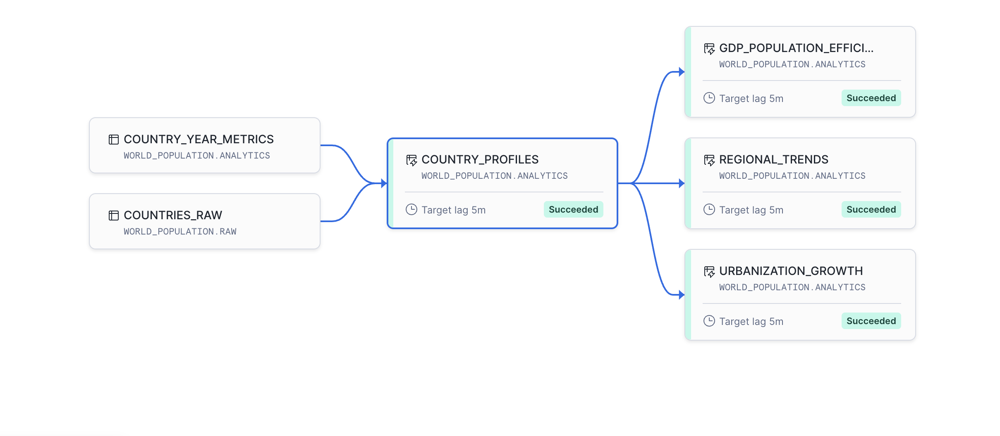
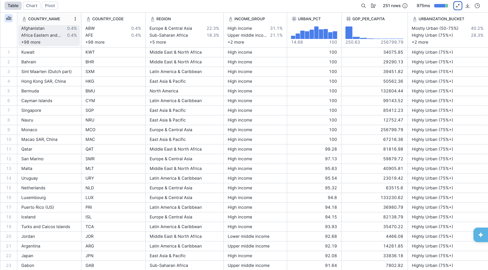

# ❄️ Snowflake Data Engineering Portfolio
### Ezra Bayewitz

[](https://www.snowflake.com/)
[]()
[]()
[]()
[]()
[]()

---

## 📌 Overview

A portfolio of **cloud data engineering projects** built entirely in Snowflake — spanning pipeline automation, dimensional modeling, change data capture, data governance, and business intelligence. Projects progress from guided Snowflake quickstarts to fully independent, production-style pipelines built on real-world public datasets.

Flagship work includes a **World Population & Geographic Trends Pipeline** ingesting 60+ years of World Bank data across 4 datasets, a **Retail Sales Pipeline** with Snowpark Python transformations, and a complete **analytics stack** delivering insights through Power BI and Streamlit.

> **Engineering focus:** Every project reflects real data engineering workflows — automated ingestion, ELT orchestration, dimensional modeling, role-based access control, and self-service analytics delivery.

---

## 🖼️ Featured Outputs

> 📸 *Screenshots coming soon — Power BI dashboards, and Streamlit app*






---

## 🗂️ Table of Contents

- [Tech Stack](#-tech-stack)
- [Key Skills Demonstrated](#-key-skills-demonstrated)
- [Portfolio Architecture Overview](#-portfolio-architecture-overview)
- [Projects](#-projects)
  - [1. World Population & Geographic Trends Pipeline](#1--world-population--geographic-trends-pipeline--flagship-project)
  - [2. Retail Sales Pipeline](#2--retail-sales-pipeline)
  - [3. End-to-End Analytics with Snowflake & Power BI](#3--end-to-end-analytics-with-snowflake--power-bi)
  - [4. Zero to Snowflake (Core Quickstart Series)](#4--zero-to-snowflake-core-quickstart-series)
- [Repository Structure](#-repository-structure)
- [Certification](#-certification)
- [Connect](#-connect)

---

## 🛠️ Tech Stack

| Category | Tools |
|---|---|
| **Cloud Data Warehouse** | Snowflake (Virtual Warehouses, Internal & External Stages, Dynamic Tables, Cortex AI, Horizon) |
| **Languages** | SQL, Python (Snowpark) |
| **Pipeline Automation** | Snowpipe, Streams (CDC), Tasks, Stored Procedures |
| **Data Transformation** | Snowpark Python, UNPIVOT, Dynamic Tables, SQL Views |
| **Dimensional Modeling** | Star Schema (Fact + Dimension tables), Bronze/Silver/Gold layering |
| **Business Intelligence** | Power BI, Streamlit in Snowflake |
| **Data Governance** | Snowflake Horizon (RBAC, dynamic data masking, PII classification, data quality) |
| **AI / ML** | Snowflake Cortex (LLM functions, Cortex Search, Cortex Analyst) |
| **Data Sources** | Internal staging, AWS S3, Snowflake Marketplace (SafeGraph geospatial), World Bank Open Data |
| **Architecture Patterns** | ELT, Change Data Capture (CDC), DAG orchestration, pipeline automation, analytics engineering |

---

## 💡 Key Skills Demonstrated

- **Pipeline Automation** — Built automated ELT pipelines using Snowpipe for continuous ingestion, Streams for change data capture, and conditional Tasks for orchestration — transformations trigger only when new data arrives
- **Data Warehousing** — Designed and provisioned full Snowflake environments including warehouse sizing, schema layering (Bronze/Silver/Gold), and cost-conscious configuration
- **Analytics Engineering** — Modeled data into star schemas and long-format analytical tables; delivered self-refreshing analytics layers via Dynamic Table dependency chains with 5-minute lag
- **Dimensional Modeling** — Built fact and dimension table structures optimized for downstream BI consumption in Power BI
- **Data Transformation** — Applied UNPIVOT logic to reshape wide-format public datasets (60+ year columns per country) into long analytical formats using Stored Procedures
- **Data Governance** — Enforced role-based access control, dynamic PII masking, and data quality monitoring using Snowflake Horizon across multi-region analytics environments
- **Semi-Structured Data** — Parsed and flattened nested JSON/VARIANT data using `FLATTEN` and lateral joins
- **AI Integration** — Applied Snowflake Cortex AI functions for LLM-powered feedback processing and conversational analytics (Cortex Analyst)
- **Third-Party Enrichment** — Acquired and integrated SafeGraph geospatial data from Snowflake Marketplace to enrich internal datasets
- **BI & Visualization** — Connected Snowflake to Power BI for regional KPI reporting and built an interactive Streamlit dashboard deployed natively in Snowflake
- **Python in Snowflake** — Wrote Snowpark transformation logic executed natively within the Snowflake execution environment

---

## 🏗️ Portfolio Architecture Overview

> 📐 *Architecture diagram coming soon — see reference below*

```
Raw Data Sources
(World Bank CSVs · Retail CSVs · S3 · Snowflake Marketplace)
                    │
                    ▼
    ┌─────────────────────────────┐
    │      Ingestion Layer        │
    │  Snowpipe · COPY INTO       │
    │  Internal & External Stages │
    │  Named File Formats         │
    └──────────────┬──────────────┘
                   │
                   ▼
    ┌─────────────────────────────┐
    │       Bronze / Raw          │  ← Unprocessed source tables
    │  Streams (CDC) monitoring   │    Wide-format public datasets
    └──────────────┬──────────────┘
                   │  Tasks + Stored Procedures
                   │  (conditional: SYSTEM$STREAM_HAS_DATA)
                   ▼
    ┌─────────────────────────────┐
    │      Silver / Analytics     │  ← UNPIVOT · clean typed data
    │  Dynamic Tables (5-min lag) │    country_year_metrics
    │  Dependency-chained DAG     │    Star Schema (Fact + Dims)
    └──────────────┬──────────────┘
                   │
                   ▼
    ┌─────────────────────────────┐
    │       Gold / Reporting      │  ← SQL Views · Horizon RBAC
    │  Business-facing views      │    PII masking · access policies
    └──────────┬──────────────────┘
               │
       ┌───────┴────────┐
       ▼                ▼
    Power BI        Streamlit
  (Dashboards)    (Interactive App)
```

---

## 📁 Projects

---

### 1. 🌍 World Population & Geographic Trends Pipeline — *Flagship Project*

**[View Project →](./world-population-pipeline/)**

**Business Problem:** Global demographic and economic data exists in abundance — but raw World Bank exports arrive as wide, country-per-row CSVs spanning 60+ years, unusable for analytics without significant reshaping. This project builds a fully automated, self-updating pipeline that ingests 4 public datasets, applies change data capture, conditionally orchestrates transformations, and delivers a continuously refreshed analytics layer answering real geographic and economic questions.

**Scale:** 4 datasets · 195+ countries · 60+ years of data (1960–2025) · 5 reporting views · automated 5-minute refresh cycle · estimated cost under $20 on a free trial account

**What I Built:**
- Ingested 4 World Bank datasets via **Snowpipe** (total population, GDP per capita, urbanization rate, country metadata)
- Implemented **APPEND_ONLY Streams** to capture raw table changes without full rescans
- Designed a **Stored Procedure** encapsulating UNPIVOT logic — reshapes wide format (1 row/country, 60+ year columns) into long analytical format (1 row per country/year/indicator)
- Scheduled **conditional Task execution** via `SYSTEM$STREAM_HAS_DATA` — cost-efficient orchestration that fires only when new data is detected
- Built a **4-table Dynamic Table dependency chain** refreshing every 5 minutes: `country_profiles` → `urbanization_growth` → `gdp_population_efficiency` → `regional_trends`
- Delivered **5 business-facing reporting views** covering urbanization velocity, GDP leadership, regional trend analysis, country snapshots, and urbanization-GDP correlation

> 📸 *Screenshot placeholder — add query output from `v_top_urbanizing_countries` and `v_gdp_leaders_2023` here*

**Pipeline Architecture:**

```
World Bank CSVs (4 files · free public data · no account required)
              │
              │  Snowpipe (manual REFRESH)
              ▼
        RAW SCHEMA
  population_raw / indicators_raw / countries_raw
  (wide: 1 row per country · 60+ year columns)
              │
              │  APPEND_ONLY Streams (CDC)
              │  Task: every 5 min · fires only if stream has data
              │  Stored Procedure: UNPIVOT wide → long
              ▼
        ANALYTICS SCHEMA
  country_year_metrics  (long: 1 row per country/year/indicator)
  Dynamic Tables (5-min lag · dependency-chained):
    country_profiles → urbanization_growth
    → gdp_population_efficiency → regional_trends
              │
              │  SQL Views
              ▼
        REPORTING SCHEMA
  5 business-facing views (see table below)
```

**Key Analytical Findings:**

| Reporting View | Business Question | Insight |
|---|---|---|
| `v_top_urbanizing_countries` | Which countries urbanized fastest 2000–2023? | Rapid urbanization concentrated in Sub-Saharan Africa and South/Southeast Asia; mature economies showed near-flat urbanization curves over the same period |
| `v_gdp_leaders_2023` | Highest GDP per capita in 2023? | Small high-income nations (Luxembourg, Switzerland, Norway) led global rankings; resource-dependent Gulf economies ranked highly despite mid-range urbanization — an outlier to the general trend |
| `v_regional_population_trends` | How have World Bank regions evolved since 1990? | East Asia & Pacific drove the largest absolute population growth; high-income regions saw growth rates slow significantly post-2000 |
| `v_country_snapshot_2023` | Full metric view per country today? | Exposes wide variance in the urbanization-GDP relationship across income groups — useful baseline for clustering or further ML modeling |
| `v_urbanization_vs_gdp` | Does urbanization correlate with GDP? | General positive correlation holds across most regions; resource-dependent economies (Gulf states, parts of Sub-Saharan Africa) are consistent outliers — high GDP with mid-range urbanization |

**Tech Used:** Snowpipe · Streams (CDC) · Tasks · Stored Procedures · UNPIVOT · Dynamic Tables · SQL Views · Snowflake SQL · cost-conscious warehouse configuration

**How to Run:**

> **Prerequisites:** Snowflake trial account (free) · 4 World Bank CSV downloads (links in each step README) · ~$20 in Snowflake credits

1. Create a Snowflake trial account at [snowflake.com](https://snowflake.com)
2. Download the four World Bank CSVs — download links provided in `docs/` READMEs for each step
3. Run scripts `01` through `06` in order using Snowsight SQL worksheets
4. When prompted in Step 2, upload the CSVs to the internal stage
5. Execute `ALTER PIPE ... REFRESH` for all four Snowpipes to trigger initial load
6. Run the backfill `INSERT` statements in Step 4 to seed the analytics layer
7. Verify output using the confirmation queries at the bottom of each script

> **Note:** Tasks are created in a suspended state. Step 4 resumes them automatically. To manually resume: `ALTER TASK <task_name> RESUME;`
> **Security:** Never commit Snowflake credentials to version control.

| File | Purpose |
|------|---------|
| `01_setup.sql` | Database, schema, warehouse provisioning |
| `02_staging_and_pipe.sql` | Stages, two named file formats (different CSV structures), Snowpipe definitions |
| `03_raw_tables.sql` | Raw table definitions with defensive patterns (`NULLIF`, `IF NOT EXISTS`, `_extra` overflow column) |
| `04_streams_and_tasks.sql` | CDC Streams, UNPIVOT Stored Procedure, conditional Task scheduling |
| `05_dynamic_tables.sql` | Analytics layer — 4 Dynamic Tables with dependency chaining |
| `06_reporting_views.sql` | 5 business-facing reporting views |

---

### 2. 🏪 Retail Sales Pipeline

**[View Project →](./retail-sales-pipeline/)**

**Business Problem:** Retail organizations accumulate raw transactional data across regions and product lines, but flat files alone can't drive business decisions. This project builds a structured, multi-layer analytics pipeline — from raw CSV ingestion through Snowpark Python transformations to clean, business-facing SQL views — simulating the workflow of a data engineer supporting a retail analytics team.

**What I Built:**
- Provisioned the full Snowflake environment from scratch (database, schemas, warehouse sizing)
- Designed internal stages and named file formats for structured CSV ingestion
- Loaded raw data into typed Bronze tables using `COPY INTO`
- Authored **Snowpark Python** transformation logic executed natively within Snowflake — no external compute required
- Delivered Gold-layer SQL reporting views ready for downstream BI consumption

> 📸 *Screenshot placeholder — add Snowflake worksheet showing reporting view output here*

**Pipeline Workflow:**

```
CSV Source Files
      │
      ▼
Internal Stage + Named File Format
      │  COPY INTO
      ▼
Raw Tables (Bronze)  ← typed, unmodified source data
      │  Snowpark Python (native Snowflake execution)
      ▼
Transformed Tables (Silver)  ← cleaned, enriched, typed
      │  SQL
      ▼
Reporting Views (Gold)  ← business-ready, query-optimized
```

**Tech Used:** Snowflake SQL · Snowpark Python · Virtual Warehouses · Internal Stages · COPY INTO · SQL Views · ELT architecture

**How to Run:**

> **Prerequisites:** Snowflake account · retail CSV source files · Snowsight or SnowSQL access

1. Run `Part 1 - Setup.sql` to provision the database, schemas, and warehouse
2. Run `Part 2 - Staging.sql` to create the internal stage and named file format
3. Upload source CSV files to the internal stage via Snowsight or `PUT` command in SnowSQL
4. Run `Part 3 - Loading Raw Data.sql` to define raw tables and execute `COPY INTO`
5. Run `Part 4 - Snowpark Transformations.py` via a Snowflake Python worksheet or Snowpark session
6. Run `Part 5 - Reporting Views.sql` to create the Gold-layer reporting views
7. Query any reporting view to verify the full pipeline end-to-end

| File | Purpose |
|------|---------|
| `Part 1 - Setup.sql` | Database, schema, and warehouse provisioning |
| `Part 2 - Staging.sql` | Internal stage and file format creation |
| `Part 3 - Loading Raw Data.sql` | Raw table definitions and COPY INTO commands |
| `Part 4 - Snowpark Transformations.py` | Snowpark Python transformation logic (native Snowflake execution) |
| `Part 5 - Reporting Views.sql` | Business-facing Gold-layer SQL views |

---

### 3. 📊 End-to-End Analytics with Snowflake & Power BI

**[View Project →](./snowflake-powerbi-analytics/)**

**Business Problem:** Tasty Bytes, a multi-region food truck business, needs a governed analytics layer that non-technical stakeholders can access through Power BI — with automatic data refresh, third-party enrichment, enforced access controls, and an interactive web dashboard. This project builds that complete stack.

**What I Built:**
- Designed the foundational analytics data layer with **region-based role segregation** — analysts only see their region's data
- Acquired and integrated **SafeGraph geospatial data** from the Snowflake Marketplace to enrich food truck location records with point-of-interest metadata
- Built a complete **star schema** (fact + dimension tables) using Snowflake Dynamic Tables — auto-refreshing as upstream data changes
- Applied **Snowflake Horizon** governance: dynamic PII masking, tag-based classification, row access policies, and data quality monitoring
- Delivered a **Streamlit in Snowflake** regional sales dashboard — interactive, natively hosted, zero external infrastructure

> 📸 *Screenshot placeholder — add Power BI dashboard and Streamlit app screenshots here*

**Architecture:**

```
Tasty Bytes Raw Data     SafeGraph (Marketplace)
         │                       │
         └───────────┬───────────┘
                     │
                     ▼
          Snowflake Dynamic Tables
          Star Schema: Fact + Dimensions
          Auto-refreshing DAG (TARGET_LAG)
          Horizon: RBAC · PII masking
                     │
           ┌─────────┴──────────┐
           ▼                    ▼
        Power BI           Streamlit App
    (Regional KPIs)    (Interactive Dashboard)
   Role-filtered views   Native Snowflake hosting
```

**Tech Used:** Dynamic Tables · Star Schema · Dimensional Modeling · Snowflake Marketplace · Snowflake Horizon · Power BI · Streamlit · RBAC · DAG orchestration

| Part | Focus | Key Outcome |
|------|-------|-------------|
| Part 1 — Data Profiling | Foundational data layer + RBAC | Region-isolated analyst roles; access-controlled schemas |
| Part 2 — Marketplace Data | SafeGraph geospatial enrichment | Food truck locations enriched with POI metadata |
| Part 3 — Star Schema | Dynamic Tables for auto-refresh | Self-updating fact/dim model consumed by Power BI |
| Part 4 — Data Governance | Horizon PII masking + policies | Sensitive fields masked; data quality alerts active |
| Streamlit App | Regional Sales Dashboard | Interactive monthly sales analysis across global regions |

---

### 4. 📚 Zero to Snowflake — *Core Quickstart Series*

**[View Project →](./Zero-to-Snowflake/)**

A structured five-part guided series covering Snowflake fundamentals through hands-on labs — building both platform fluency and SnowPro Core certification readiness.

| Part | Focus | Skills Gained |
|------|-------|--------------|
| **Part 1** | Setup & Fundamentals | Virtual Warehouse scaling, Query Result Cache, Zero-Copy Cloning, Time Travel + UNDROP, Resource Monitors, Budgets |
| **Part 2** | Simple Data Pipeline | S3 external stage ingestion, VARIANT/semi-structured data, FLATTEN, Dynamic Tables, DAG visualization |
| **Part 3** | Cortex AI | LLM playground, Cortex AI Functions (systematic feedback processing), Cortex Search, Cortex Analyst (conversational SQL) |
| **Part 4** | Governance with Horizon | PII classification, dynamic data masking, row access policies, data quality monitoring |
| **Part 5** | Apps & Collaboration | Snowflake Marketplace data shares, Streamlit in Snowflake, weather + geospatial enrichment for sales analysis |

---

## 📂 Repository Structure

```
Snowflake/
│
├── world-population-pipeline/          ← 🌍 Flagship (Snowpipe · CDC Streams · Tasks · Dynamic Tables)
│  ├── 01-environment-setup.sql
│  ├── 02-creating-raw-tables.sql
│  ├── 03-data-ingestion-snowpipe.sql
│  ├── 04-data-transformation.sql
│  ├── 05-analytics-data-model.sql
│  ├── 06-business-reporting-views.sql
│  └── docs/
│
├── retail-sales-pipeline/              ← 🏪 ELT pipeline with Snowpark Python
│   ├── 01-environment-setup.sql
│   ├── 02-data-ingestion-setup.sql
│   ├── 03-raw-data-loading.sql
│   ├── 04-data-transformation-snowpark.py
│   ├── 05-sales-reporting-views.sql
│
├── snowflake-powerbi-analytics/        ← 📊 Star schema · Power BI · Streamlit · Horizon
│   ├── Part-1/   ← Data Profiling + RBAC
│   ├── Part-2/   ← Marketplace Data (SafeGraph)
│   ├── Part-3/   ← Star Schema with Dynamic Tables
│   ├── Part-4/   ← Data Governance (Horizon)
│   └── Streamlit/   ← Regional Sales Dashboard
│
├── Zero-to-Snowflake/                  ← 📚 Core quickstart labs (guided)
│   ├── Part-1/   ← Setup & Fundamentals
│   ├── Part-2/   ← Simple Data Pipeline
│   ├── Part-3/   ← Cortex AI
│   ├── Part-4/   ← Governance with Horizon
│   └── Part-5/   ← Apps & Collaboration
│
├── notes/                              ← 📝 SnowPro Core study notes
└── README.md
```

> **Note on folder naming:** Independent projects use lowercase hyphen-separated names (`world-population-pipeline`, `retail-sales-pipeline`, `snowflake-powerbi-analytics`) for clean GitHub URL rendering and consistent navigation.

---

## 🎓 Certification

**SnowPro Core Certification — Snowflake**
- Status: 🟡 In Progress
- Candidate: Ezra Bayewitz
- Domains: Virtual Warehouses · Data Loading & Transformation · Performance Optimization · Security & Governance · Semi-Structured Data · Cortex AI · Data Sharing

---

## 🔮 What's Next

- [ ] Complete SnowPro Core Certification
- [ ] Replace ASCII architecture diagrams with visual diagrams (Excalidraw / Lucidchart)
- [ ] Add Snowflake DAG screenshots for World Population Pipeline
- [ ] Add Power BI dashboard screenshots to End-to-End Analytics project
- [ ] Add Streamlit app screenshots to Regional Sales Dashboard
- [ ] Add query output screenshots for World Population reporting views
- [ ] Expand World Population Pipeline with additional World Bank indicators (literacy rate, life expectancy)
- [ ] Explore dbt Core integration as a declarative SQL transformation layer
- [ ] Explore Snowflake Data Clean Rooms

---

## 🤝 Connect

- 💼 **LinkedIn:** [linkedin.com/in/ezra-bayewitz](https://www.linkedin.com/in/ezra-bayewitz)
- 🌐 **Portfolio:** Coming soon

---

*Focused on building production-style cloud data engineering workflows using Snowflake, Snowpark, and modern analytics tooling.*
